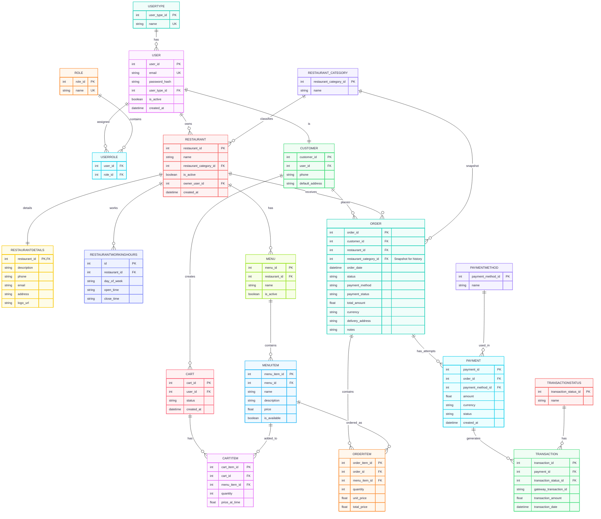

# Food Delivery System

## 📌 About The Project

The **Food Delivery System** is a scalable, secure, and feature-rich platform designed to manage the complete food ordering lifecycle — from restaurant discovery to payment settlement and analytics.

The system supports **multi-restaurants**, **multiple payment methods**, **real-time order tracking**, and **advanced analytics dashboards** for both the platform and restaurants.

It is built to be:

-  Multi-country & multi-language ready
-  High performance & scalable
-  Secure with full payment auditing
-  Data-driven with detailed insights

---

##  System Feature List

Below is a structured overview highlighting all the key features available in the platform

---

# 👤 User Management Features

##  Authentication & Account Management

- **Login**
    
    Users can log in using their phone number or email address.
    
- **Registration**
    
    Create a new user account.
    
- **Password Recovery**
    
    Reset password using OTP verification.
    
- **Change Password**
    
    Update the current password securely.
    

---

##  User Profile & Settings

- **View Profile**
    
    View personal profile information.
    
- **Edit Profile**
    - Edit Email
    - Edit First Name
    - Edit Last Name
    - Edit Phone Number

---

##  Address Management

- **Add Address**
    
    Save a new delivery address.
    
- **Edit Address**
    
    Update an existing address.
    
- **Delete Address**
    
    Remove an address.
    
- **Set Default Address**
    
    Select a default address for orders.
    

---

# 🔍 Discovery & Browsing Features

##  Restaurant & Food Browsing

- **Browse Restaurants by Category**
    
    Discover restaurants by food category (Burger, Pizza, etc.).
    
- **Browse Restaurant Menu**
    
    View restaurant menus.
    
- **Browse Product Details**
    
    View detailed dish information.
    

---

##  Ratings & Recommendations

- **Top-Rated Restaurants**
    
    Discover restaurants with the highest ratings.
    
- **Top-Rated Dishes**
    
    View the most popular and highly rated dishes.
    

---

##  Sorting & Filtering

Restaurants can be sorted by:

- Recommendations
- Alphabetical Order (A–Z)
- High Rating
- Fast Delivery
- Nearest Location (Based on user location)

---

##  Search

- **Search Restaurants**
    
    Search by restaurant name or category.
    
- **Search Food Items**
    
    Search for specific dishes.
    

---

##  Nearby Restaurants

- Detect and display restaurants closest to the user using geolocation data.

---

# 🛒 Cart Management

- Add products to cart
- Apply discount / voucher codes
- Edit cart contents
- Increase or decrease product quantity
- View cart details
- Remove specific items
- Clear the entire cart

---

# 📦 Order Management

- **Place Order**
    
    Submit an order successfully.
    
- **Cancel Order**
    
    Cancel orders by customer or restaurant.
    
- **Real-Time Order Tracking**
    - Pending
    - Preparing
    - Out for Delivery
    - Delivered
- **Notifications**
    
    Instant updates when order status changes.
    
- **Order History**
    
    View completed, canceled, or failed orders.
    
- **Detailed Order View**
    
    Full order breakdown and timeline.
    
- **Automated Confirmation**
    
    Email or SMS confirmation after order placement.
    
- **Payment Options**
    - Cash on Delivery (COD)
    - Online Payment
    - Wallet Payment

---

# 💳 Payment & Wallet System

> Not just a payment gateway — a full financial ecosystem
> 

##  Payment Integration

- Initiate payments via payment API
- Verify completed payments
- Process refunds

---

##  Payment Verification & Validation

- Validate Transaction ID (non-duplicate)
- Verify paid amount matches order amount
- Confirm correct Order ID

---

##  Multiple Payment Methods

- Credit Cards
- Debit Cards
- Digital Wallets
- Cash on Delivery (COD)

---

##  Transaction Management

- **Restaurant Dashboard**
    - View successful, failed, and refunded transactions
- **System Dashboard**
    - Global view of all platform transactions

---

##  Real-Time Payment Status

- Pending
- Completed
- Failed
- Refunded
- Voided

---

##  Digital Receipts

- Automatically generate digital receipts for every successful transaction.

---

##  Security & Error Handling

- Server-side transaction validation
- Secure data handling
- User-friendly error messages

---

##  Auditing & Logging

- Full request & response logging
- Timestamped payment lifecycle records
- Used for debugging and dispute resolution

---

##  Financial Auditing

- Revenue reconciliation
- Vendor payouts calculation
- Platform commission tracking

---

# 🎁 Offers & Promotions

- **Voucher Codes**
    
    Apply promo codes during checkout.
    
- **Restaurant Offers**
    
    Deals like *Buy 1 Get 1* or special discounts.
    

---

# 📊 Analytics & Dashboard (System)

##  Platform Statistics

- Total Restaurants Count
- Total Customers Count
- Active Customers Count
- Daily Orders Count
- Total Orders Count
- Daily Cancelled Orders
- Total Cancelled Orders

---

##  Financial Metrics

- Daily Transactions Amount
- Total Transactions Amount
- Daily Financial Report
- Monthly Financial Report

---

# 🏪 Analytics & Dashboard (Restaurant)

##  Order Analytics

- Daily Orders Count
- Daily Undelivered Orders
- Total Orders Count
- Daily Cancelled Orders
- Total Cancelled Orders

---

##  Financial Analytics

- Daily Sales Amount
- Total Sales Amount

---

##  Reports & Insights

### Daily Transactions Report

Includes:

- Total orders
- Successful & canceled orders
- Total revenue
- Platform commission
- Net payout for restaurant

### Monthly Transactions Report

Helps restaurants with:

- Accounting
- Performance analysis
- Revenue tracking

---

##  Localization & Regional Settings

Designed to support users across different regions and cultures.

- **Multi-Language Support**
    
    The platform allows users to seamlessly switch between multiple languages such as English, Arabic, and more.
    
- **Multi-Region & Currency Support**
    
    Supports multiple countries with localized currencies, formats, and regional settings.
    
- **Smart Region Detection**
    
    Automatically detects the user’s location using IP address or GPS data on first launch to deliver localized content, pricing, and currency.

---
# 📝 USE CASE: PLACE ORDER

##  FLOW CHART


##  Sequence Diagram


##  Pseudocode

```js 
FUNCTION PlaceOrder(user_id, cart_id, payment_method, address_id, voucher_code):

    // 1. User enters system
    // Actor: User
    DISPLAY "Welcome to Food App"

    // 2. User browsing
    // Actor: User
    products = System.BrowseRestaurantsAndProducts()
    UserAddsToCart(cart_id, products)

    // 3. System shows cart message
    // Actor: System
    System.ShowMessage("View cart")

    // 4. User enters cart and modifies quantity
    // Actor: User
    cart_items = System.GetCartItems(cart_id)
    UserModifyQuantity(cart_items)

    IF CartIsEmpty(cart_items):
        // Actor: System
        System.ShowMessage("There is nothing in your cart yet")
        RETURN Error("Cart empty")
    ELSE:
        UserChoosesNextAction = GetUserChoice("Continue browsing / Checkout")
        IF UserChoosesNextAction == "Checkout":

            // 5. Address handling
            // Actor: System & DB
            addresses = DB.GetAddresses(user_id)
            chosen_address = UserChooseAddress(addresses)

            IF chosen_address == "New Address":
                new_address = UserEnterAddressDetails()
                DB.SaveAddress(user_id, new_address)
                chosen_address = new_address

            // 6. Voucher
            voucher = UserEnterVoucher(voucher_code)
            IF voucher != None:
                System.ApplyVoucher(voucher)

            // 7. Payment Processing
            IF payment_method == "Card":
                card_details = UserEnterCardDetails()
                TRY:
                    payment_response = PaySystem.ProcessPayment(card_details, cart_items.total)
                    System.ValidatePayment(payment_response)
                    DB.UpdatePaymentStatus(cart_id, payment_response.status)
                CATCH Exception:
                    RETURN Error("Payment failed")
            ELSE IF payment_method == "Cash":
                System.PlaceOrder(cart_id, chosen_address, payment_method)

            // 8. Notification
            System.SendNotification("Order confirmed", user_id)
            SMSSystem.SendSMS("Order placed successfully", user_id)

    RETURN Success("Order completed")
END FUNCTION

```

---

# Database ERD 

## 🧱 STEP 1: ENTITIES

### 👤 User & Access

* User
* UserType
* Role
* UserRole
* Customer

---

### 🍴 Restaurant & Menu

* Restaurant
* RestaurantDetails
* RestaurantWorkingHours
* Menu
* MenuItem
* RestaurantCategories

---

### 🛒 Cart & Order

* Cart
* CartItem
* Order
* OrderItem

### 💵 Payment

* PaymentMethod
* TransactionStatus
* Payment
* Transaction

---

## 🧩 STEP 2: ATTRIBUTES 

### 👤 User

```
User
- user_id (PK)
- email (Unique)
- password_hash
- user_type_id (FK)
- is_active
- created_at
```

---

### 👤 UserType

```
UserType
- user_type_id (PK)
- name (Customer, RestaurantOwner, Admin)
```

---

### 👤 Role

```
Role
- role_id (PK)
- name (ManageMenu, ViewOrders, ManageCart)
```

---

### 👤 UserRole

```
UserRole
- user_id (FK)
- role_id (FK)
```

---

### 👤 Customer

```
Customer
- customer_id (PK)
- user_id (FK)
- phone
- default_address
```

---

### 🍴 Restaurant Categories

```
RestaurantCategories
- restaurant_Categories (PK)
- name
```

---


### 🍴 Restaurant

```
Restaurant
- restaurant_id (PK)
- name
- category_type (FK)
- is_active
- owner_user_id (FK → User)
- created_at
```

---

### 🍴 RestaurantDetails

```
RestaurantDetails
- restaurant_id (PK & FK)
- description
- phone
- email
- address
- logo_url
```

---

### 🍴 RestaurantWorkingHours

```
RestaurantWorkingHours
- id (PK)
- restaurant_id (FK)
- day_of_week
- open_time
- close_time
```

---

### 📋 Menu

```
Menu
- menu_id (PK)
- restaurant_id (FK)
- name
- is_active
```

---

### 📋 MenuItem

```
MenuItem
- menu_item_id (PK)
- menu_id (FK)
- name
- description
- price
- discount_price
- is_available
```

---

### 🛒 Cart

```
Cart
- cart_id (PK)
- user_id (FK)
- status (Active, CheckedOut, Abandoned)
- created_at
```

---

### 🛒 CartItem

```
CartItem
- cart_item_id (PK)
- cart_id (FK)
- menu_item_id (FK)
- quantity
- price_at_time
```

### Order

```
Order
- order_id (PK)
- customer_id (FK)
- resturant_id (FK)
- resturant_category_id(FK)
- order_date
- status
- payment_status
- payment_method
- total_amount
- delivery_fee
- tax_amount
- currency
- delivery_address_info
- notes
```
### Order Item

```
OrderItem
- order_item_id (PK)
- order_id (FK)
- menu_item_id (FK)
- quantity
- unit_price
- total_price

```

### Payment Method

```
PaymentMethod
- payment_method_id (PK)
- name
```

### Transaction Status

```
TransactionStatus
- transaction_status_id (PK)
- name
```

### Payment

```
Payment
- payment_id (PK)
- order_id (FK)
- Payment_method_id (FK)
- amount
- currency
- status
- created_At
```

### Transaction

```
Transaction
- transaction_id (PK)
- payment_id (FK)
- gateway_response
- transaction_status_id (FK)
- gateway_transaction_id
- transaction_amount
- transaction_date
```

---

## 🔗 STEP 3: RELATIONSHIPS 

#### User ↔ UserType

```
User * ---- 1 UserType
```

---

#### User ↔ Role

```
User * ---- * Role
(via UserRole)
```

---

#### User ↔ Customer

```
User 1 ---- 0..1 Customer
```

---

#### User ↔ Restaurant

```
User 1 ---- * Restaurant
(Owner)
```

---

#### Restaurant ↔ Menu

```
Restaurant 1 ---- * Menu
```

---

#### Menu ↔ MenuItem

```
Menu 1 ---- * MenuItem
```

---

#### Customer ↔ Cart

```
Customer 1 ---- * Cart

```

---

#### Cart ↔ CartItem

```
Cart 1 ---- * CartItem
```

---

#### MenuItem ↔ CartItem

```
MenuItem 1 ---- * CartItem
```


#### Order ↔ Customer

```
Order * ---- 1 Customer
```

#### Order ↔ Restaurant

```
Order * ---- 1 Restaurant
```

#### Order ↔ RestaurantCategory

```
Order * ---- 1 RestaurantCategory
```

#### OrderItem ↔ Order

```
OrderItem * ---- 1 Order
```
#### OrderItem ↔ MenuItem

```
OrderItem * ---- 1 MenuItem
```

#### Payment ↔ Order

```
Payment * ---- 1 Order
```

#### Payment ↔ PaymentMethod

```
Payment * ---- 1 PaymentMethod
```

#### Transaction ↔ Payment

```
Transaction * ---- 1 Payment
```

#### Transaction ↔ TransactionStatus

```
Transaction * ---- 1 TransactionStatus
```


---

## ⛓ STEP 4: CONSTRAINTS

### 🔐 Uniqueness

* User.email UNIQUE
* UserType.name UNIQUE
* Role.name UNIQUE
* MenuItem (menu_id, name) UNIQUE

---


##  ERD Diagram



----


## 🚀 API Documentation

### 1️⃣ Authentication & Authorization

| Method | Endpoint | Input (Body/Query) | Output (Success 200/201) |
| --- | --- | --- | --- |
| `POST` | `/api/v1/auth/send-otp` | `{ "phone": "010..." }` | `{ "message": "OTP sent successfully" }` |
| `POST` | `/api/v1/auth/verify-otp` | `{ "phone": "010...", "otp": "1234" }` | `{ "token": "jwt_string", "is_new_user": true }` |

### 2️⃣ Profile & Address Management

| Method | Endpoint | Input (Body/Query) | Output (Success 200/201) |
| --- | --- | --- | --- |
| `PUT` | `/api/v1/profile` | `{ "first_name": "Moaz", "email": ".." }` | `{ "user_id": 1, "status": "updated" }` |
| `POST` | `/api/v1/addresses` | `{ "street": "...", "lat": 30.1, "lng": 31.2 }` | `{ "address_id": 101, "message": "Address saved" }` |
| `GET` | `/api/v1/addresses` | `None` | `[{ "id": 101, "street": "...", "is_default": true }]` |

### 3️⃣ Discovery (Restaurants & Menu)

| Method | Endpoint | Input (Body/Query) | Output (Success 200) |
| --- | --- | --- | --- |
| `GET` | `/api/v1/restaurants` | `?cat_id=1&lat=30.1&lng=31.2` | `[{ "id": 5, "name": "Moaz Burger", "distance": "2km" }]` |
| `GET` | `/api/v1/restaurants/{id}/menu` | `Path Variable: id` | `{ "restaurant": {}, "categories": [{ "items": [] }] }` |

### 4️⃣ Cart Management

| Method | Endpoint | Input (Body/Query) | Output (Success 200/201) |
| --- | --- | --- | --- |
| `POST` | `/api/v1/cart/items` | `{ "menu_item_id": 50, "quantity": 1 }` | `{ "cart_id": 1, "total_items": 3 }` |
| `GET` | `/api/v1/cart` | `None` | `{ "items": [...], "sub_total": 250, "tax": 20 }` |
| `PATCH` | `/api/v1/cart/items/{id}` | `{ "quantity": 2 }` | `{ "message": "Quantity updated" }` |

### 5️⃣ Order & Payment Flow

| Method | Endpoint | Input (Body/Query) | Output (Success 200/201) |
| --- | --- | --- | --- |
| `POST` | `/api/v1/orders` | `{ "address_id": 101, "payment_method": "card" }` | `{ "order_id": 500, "total": 270 }` |
| `POST` | `/api/v1/payments/initiate` | `{ "order_id": 500 }` | `{ "payment_url": "https://...", "transaction_id": "tx_1" }` |
| `POST` | `/api/v1/payments/webhook` | `{ "status": "success", "order_id": 500 }` | `{ "status": "acknowledged" }` |

